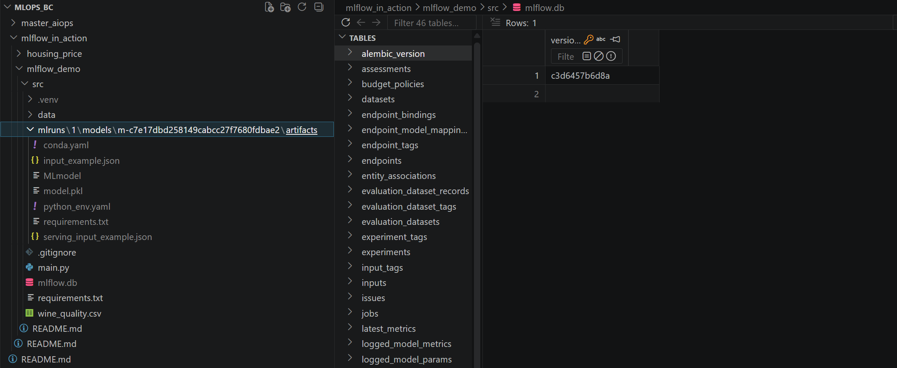

# Lí thuyết
## Chi tiết các bảng chính trong Database MLFlow

- 📑 **Experiments & Runs**: Quản lý **định danh thí nghiệm và các lần chạy**.

    | Bảng | Cột khóa | Các cột khác | Ý nghĩa |
    | :--- | :--- | :--- | :--- |
    | **Experiments** | `experiment_id` (PK) | `name`, `artifact_location`, `lifecycle_stage` | Quản lý định danh và nơi lưu trữ của một nhóm thực nghiệm. |
    | **Runs** | `run_id` (PK) | `experiment_id` (FK), `status`, `start_time`, `end_time`, `lifecycle_stage` | Chi tiết về một phiên chạy huấn luyện cụ thể. |

- 📈 **Tracking Data** (Nội dung thực nghiệm): **Lưu trữ các thông số kỹ thuật và kết quả đo lường**.

    | Bảng | Cột khóa | Các cột khác | Ý nghĩa |
    | :--- | :--- | :--- | :--- |
    | **Metrics** | `run_id` (FK) | `key`, `value`, `timestamp`, `step` | Lưu trữ các kết quả đo lường (RMSE, R2) theo thời gian. |
    | **Params** | `run_id` (FK) | `key`, `value` | Lưu trữ các tham số cấu hình (Alpha, L1_Ratio) của mô hình. |
    | **Tags** | `run_id` (FK) | `key`, `value` | Các nhãn thông tin bổ sung (tên model, loại dataset). |
    | **Artifacts** | `run_id` (FK) | `artifact_path`, `file_type`, `location` | Quản lý các file vật lý (file .pkl, ảnh đồ thị) được lưu trữ. |

- 🏗️ **Model Registry**: **Quản lý vòng đời mô hình** khi đưa lên stage.
    | Bảng | Cột khóa | Các cột khác | Ý nghĩa |
    | :--- | :--- | :--- | :--- |
    | **Model Registry**| `name`, `version` | `run_id` (FK), `stage`, `creation_time` | Quản lý các phiên bản mô hình đã đăng ký để sẵn sàng deploy. |

    
     
    <i>Demo folder mlruns/ và mlflow.db</i>

## 🛠️ Các loại URI Scheme trong MLflow

| Scheme | Cách dùng | Ý nghĩa |
| :--- | :--- | :--- |
| **`runs:/`** | `runs:/<run_id>/<path>` | Truy cập tài nguyên (artifacts/data) thuộc về một Run cụ thể thông qua ID. |
|**`models:/`** | `models:/<name>/<version_or_stage>` | Truy cập tài nguyên đã được đăng ký trong Model Registry. |
|**`file:/`** | `file:/path/to/directory` | Truy cập tài nguyên trực tiếp từ hệ thống tệp cục bộ (Local Filesystem). |
|**`s3:/`** | `s3://<bucket>/<path>` | Truy cập tài nguyên được lưu trữ trên Amazon S3 (hoặc các object storage tương đương). |