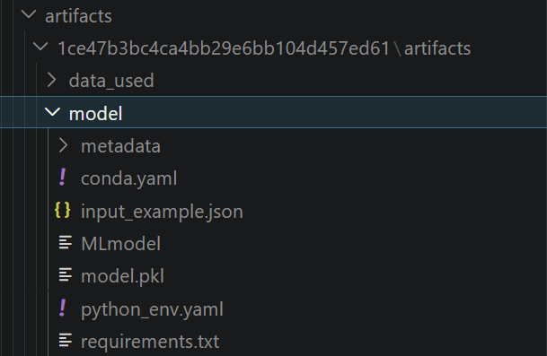

# Sec08: Model Component

## Tóm tắt cốt lõi
- **Model Component:** Định dạng đóng gói chuẩn hóa giúp mô hình chạy được trên mọi hạ tầng (Docker, Cloud, Spark).
- **Cấu trúc Folder:** Chứa trọng số mô hình, file cấu hình MLmodel, file môi trường và mô tả dữ liệu mẫu.
- **Flavor:** Hàm cho phép một mô hình được load theo nhiều cách khác nhau, **phổ biến nhất là pyfunc** (vạn năng).
- **Model Signature:** Bản hợp đồng quy định kiểu dữ liệu đầu vào/đầu ra, giúp phát hiện lỗi sớm khi triển khai.
- **Enforcement Rules:** Được tạo ra từ Signature, **là cơ chế "gác cổng" khi Inference** tự động kiểm tra tên cột và ép kiểu dữ liệu **trước khi đưa dữ liệu qua model**.
- **API log/save:** log_model dùng để lưu vào Tracking Server, trong khi save_model dùng để xuất mô hình ra ổ đĩa cục bộ.
- **Inference linh hoạt:** Sử dụng load_model kèm theo dst_path để tải và quản lý bản sao mô hình tại máy local.

<br>
<div align="center">
    
    <br>
    <i>Demo folder <b><code>&lt;artifact_location&gt;/&lt;run_id&gt;/artifacts/model/</code></b></i>
</div>

## 1. Tổng quan về Model Component

MLflow Model là một định dạng chuẩn hóa để đóng gói các mô hình Machine Learning giúp chúng có thể tái sử dụng trong nhiều công cụ hạ tầng khác nhau (Docker, Spark, Cloud Serving).

### 1.1. Cấu trúc thư mục của một Model Component
Khi sử dụng lệnh `mlflow.log_model()`, MLflow tạo ra một folder (xem [cụ thể](#21-storage-format)), chứa:
* **Model Files (Trọng số):** Các file binary chứa tri thức của model (ví dụ: `model.pkl`, `data.bin`, `weights.h5`).
* **File `MLmodel` (Trái tim):** File YAML định nghĩa các **"Flavor"** (Hương vị). Nó đóng vai trò như một bản hướng dẫn sử dụng, cho hệ thống biết mô hình này có thể được load bằng cách nào.
* **File môi trường (`conda.yaml` / `requirements.txt` / `python_env.yaml`):** Liệt kê chính xác các thư viện và version để tái lập môi trường chạy.
* **Input Example / Signature:** Định nghĩa cấu trúc dữ liệu đầu vào (schema) để tránh lỗi kiểu dữ liệu khi dự đoán.

### 1.2. Khái niệm "Flavor" (Hương vị)
* **Built-in Flavors:** Các thư viện phổ biến được hỗ trợ sẵn như `mlflow.sklearn`, `mlflow.pytorch`, `mlflow.tensorflow`.
* **Python Function (pyfunc):** Định dạng vạn năng. Mọi model khi được log dưới dạng `pyfunc` đều có thể dùng chung một lệnh `.predict()` duy nhất.

---

## 2. Các thành phần chi tiết

### 2.1. Storage Format
- Hệ thống lưu trữ theo cấu trúc thư mục. Mỗi lần chạy (Run) sẽ có một folder riêng, giúp quản lý phiên bản (versioning) và tránh ghi đè dữ liệu.
- Thư mục này nằm ở trong folder được định nghĩa ở **`artifact_location`** khi **`create_experiment`**.
    - Ví dụ: `..../artifacts/1ce47b3bc4ca4bb29e6bb104d457ed61/artifacts/model` 
    - Trong đó: `1ce47b3bc4ca4bb29e6bb104d457ed61` là **`run_id`**, `.../artifacts` là **`artifact_location`**.

### 2.2. Model Signature (Hợp đồng dữ liệu)
- Signature **định nghĩa schema đầu vào và đầu ra** của mô hình.

    ```python
    from mlflow.models.signature import ModelSignature
    from mlflow.types.schema import Schema, ColSpec
    
    signature = mlflow.models.infer_signature(X_train, model.predict(X_train))

    # Equivalent to 

        # input_schema = Schema([ColSpec("double", "feature1"), ColSpec("double", "feature2")])
        # output_schema = Schema([ColSpec("long")])
        # signature = ModelSignature(inputs=input_schema, outputs=output_schema)
    ```

- Khi **inference qua các Flavor**, **Flavor function kiểm tra** các **enforcement rules** được **tạo ra từ signature**.
    - **Enforcement Rules (Quy tắc bắt buộc):**
        - **Name-ordering:** Kiểm tra tên các cột dữ liệu truyền vào.
        - **Input-type:** Kiểm tra kiểu dữ liệu (ví dụ: `int`, `float`, `string`). Nếu truyền sai (ví dụ truyền `string` vào cột `float`), MLflow sẽ báo lỗi ngay lập tức.
        - **Signature Validation:** Đảm bảo số lượng cột dữ liệu khớp với lúc huấn luyện.

    - **Enforcement Rule trong Workflow:**
        - Cơ chế thực thi (Enforcement) diễn ra ở giai đoạn **Inference** (Dự đoán), cụ thể là bên trong hàm:
            - **`mlflow.pyfunc.predict()`**: Tự động kiểm tra dữ liệu đầu vào dựa trên Signature đã lưu.
            - **`mlflow models serve`**: Kiểm tra tính hợp lệ của dữ liệu gửi qua API (HTTP Request).
        - **Các bước kiểm tra:**
            1. **Kiểm tra Schema:** Số lượng và tên cột.
            2. **Ép kiểu (Type Casting):** Chuyển đổi dữ liệu về kiểu an toàn (ví dụ: `int` sang `float`).
            3. **Báo lỗi (Validation Error):** Nếu dữ liệu không thể ép kiểu hoặc thiếu thông tin bắt buộc.

### 2.3. Model API
- Dưới đây là bảng so sánh chi tiết các hàm trong module `mlflow.sklearn`:

    | Lệnh | Ý nghĩa | Tham số quan trọng | Đặc điểm lưu ý |
    | :--- | :--- | :--- | :--- |
    | **`log_model()`** | Lưu model vào Artifacts của một **Run**. | `sk_model`, `artifact_path`, `signature`, `input_example`, `registered_model_name`, `metadata`, `params`, `tags` | Dùng trong Training. Hỗ trợ đăng ký model trực tiếp và gắn tags/params vào model. |
    | **`save_model()`** | Lưu model ra một **đường dẫn local**. | `sk_model`, `path`, `signature`, `input_example`, `conda_env`, `code_paths`, `metadata` | Dùng khi muốn xuất mô hình ra ổ đĩa. Yêu cầu thư mục `path` phải chưa tồn tại. |
    | **`load_model()`** | Tải model để dự đoán (Inference). | `model_uri`, `dst_path` | `model_uri` có thể là đường dẫn local, URI của Run (`runs:/...`) hoặc từ Model Registry. |

- Xem kĩ về các hàm cũng như nhiều ví dụ cụ thể tại [mlflow.org/**mlflow.sklearn.log_model**](https://mlflow.org/docs/latest/api_reference/python_api/mlflow.sklearn.html#mlflow.sklearn.log_model).

---

## 3. Code mẫu triển khai chuyên nghiệp

Dưới đây là cách sử dụng `log_model` kèm theo các tham số nâng cao như **Signature**, **Input Example** và **Metadata**:

```python
import mlflow
import pandas as pd
from sklearn.ensemble import RandomForestClassifier
from mlflow.models.signature import infer_signature

# 1. Chuẩn bị dữ liệu và mô hình
X_train = pd.DataFrame({'feature1': [1, 2], 'feature2': [0.5, 0.8]})
y_train = [0, 1]
model = RandomForestClassifier()
model.fit(X_train, y_train)

# 2. Tạo Signature và Input Example
signature = infer_signature(X_train, model.predict(X_train))
input_example = X_train.iloc[[0]]

# 3. Log model với đầy đủ metadata
with mlflow.start_run():
    mlflow.sklearn.log_model(
        sk_model=model,
        artifact_path="rf-model-v1",
        signature=signature,
        input_example=input_example,
        metadata={"project": "UIT_AI_Class", "author": "Student_23520519"},
        tags={"stage": "beta"}
    )
    # Equivalent to: mlflow.sklearn.save_model(model, path="my_model", signature=signature)

# 4. Load model và dự đoán (Inference)
loaded_model = mlflow.pyfunc.load_model("runs:/<run_id>/rf-model-v1")
predictions = loaded_model.predict(X_train)

print("Model Component đã được đóng gói và kiểm thử thành công!")