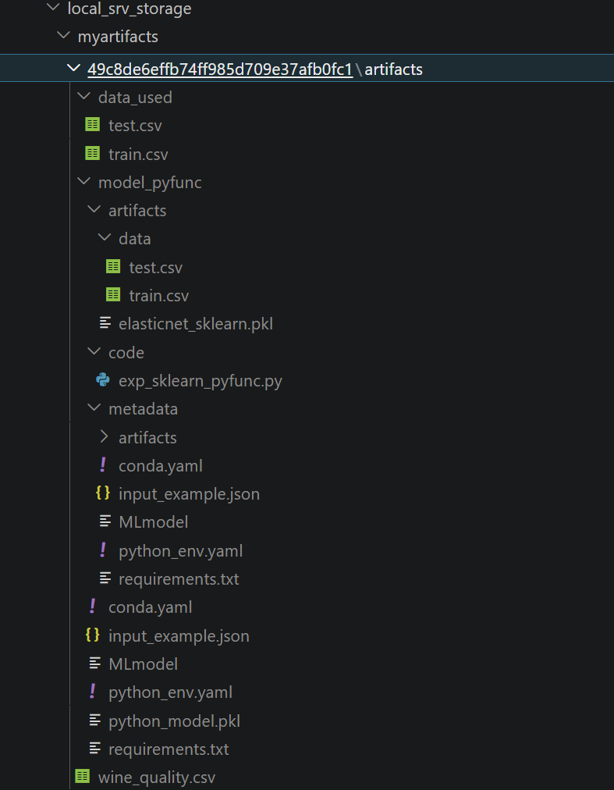

# Sec09: Handling Customized Models với MLflow PyFunc

Hướng dẫn quản lý và đóng gói mô hình tùy chỉnh (Custom Models) bằng Framework **`mlflow.pyfunc`**, chủ yếu làm việc với file [exp_sklearn_pyfunc.py](/mlflow_in_action/mlflow_demo/src/client/experiments/exp_sklearn_pyfunc.py).

## Tóm tắt 

- Để làm việc với Custom PyFunc mà không bị lỗi, hãy ghi nhớ "bộ quy tắc" sau:

    | Giai đoạn | Quy tắc vàng |
    | :--- | :--- |
    | **Log Model** | Phải ép kiểu `float()`/`int()` cho mọi giá trị trong `metadata` để tránh lỗi YAML. |
    | **Lưu File** | Luôn dùng `Path().mkdir()` trước khi `joblib.dump()` vì Python không tự tạo thư mục. |
    | **Code Path** | MLflow sẽ ưu tiên `sys.path.insert(0, code/)`. Hãy để logic bổ trợ vào đây. |
    | **Load Context** | Luôn lấy đường dẫn file qua `context.artifacts["key"]`, đừng dùng đường dẫn cứng. |
    | **Windows Path** | Khi `load_model` bằng đường dẫn tuyệt đối, hãy dùng `.as_uri()` để tránh lỗi `d:` scheme. |

- Sơ đồ tư duy quá trình Load Model (xem kĩ hơn [Workflow](#2-luồng-hoạt-động-workflow-khi-load-model)):
    1. **Download Artifacts** (Về thư mục tạm).
    2. **Inject `code/` từ thư mục tạm vào sys.path** (Ưu tiên nạp code tùy chỉnh).
    3. **Map Context** (Ánh xạ context $\rightarrow$ Path tuyệt đối của thư mục tạm tại máy local).
    4. **Init Wrapper** (Khởi tạo Class & chạy `load_context`).
    5. **Ready** (Model đã sẵn sàng nhận `.predict()`).

---


## 1. Tổng quan về `mlflow.pyfunc.log_model`

Hàm này đóng vai trò "đóng gói" mô hình thành một định dạng vạn năng (Generic Model), cho phép triển khai trên Docker, Kubernetes hoặc Spark mà không cần phụ thuộc vào code framework gốc.

### Các tham số quan trọng:
| Tham số | Kiểu dữ liệu | Mô tả |
| :--- | :--- | :--- |
| **artifact_path** | `str` | Tên thư mục lưu trữ model trong Run (ví dụ: `"model_pyfunc"`). |
| **python_model** | `Instance` | Một instance của class kế thừa từ `mlflow.pyfunc.PythonModel`. |
| **artifacts** | `dict` | Dictionary ánh xạ tên với đường dẫn file tĩnh (weights, configs, data). |
| **code_path** | `list` | Danh sách đường dẫn đến các file Python bổ trợ hoặc thư viện custom. |
| **pip_requirements** | `str`/`list` | Đường dẫn file `requirements.txt` hoặc danh sách các thư viện cần thiết. |
| **signature** | `ModelSignature` | Định nghĩa kiểu dữ liệu đầu vào và đầu ra của model. |
| **metadata** | `dict` | Các thông tin bổ sung (ví dụ: `{"rmse": 0.79}`). |

Xem kĩ hơn trên [mlflow.org/mlflow.pyfunc.log_mode](https://mlflow.org/docs/latest/api_reference/python_api/mlflow.pyfunc.html#mlflow.pyfunc.log_model).

---

## 2. Luồng hoạt động (Workflow) khi Load Model

- Sau khi đã hoàn thành thí nghiệm và thực hiện `mlflow.pyfunc.log_model` lên server.

    <div align="center">
        <i>Demo folder <b>log_model()</b>: <b><code>artifacts/model_pyfunc/</code></b> trên server</i>
        <br>
        
    </div>


- Khi gọi `mlflow.pyfunc.load_model()` (xem [code mẫu bên dưới](#4-code-mẫu-triển-khai)), **MLflow** thực hiện **quy trình 5 bước** sau:


    1. **Download & Extract** (Mặt vật lý)

        MLflow **tải toàn bộ thư mục `model` (model_pyfunc/) từ Server về một thư mục tạm ngẫu nhiên** trên máy local (ZBook).

        -   **Path trên Server:** `<artifact_location>/<run_id>/artifacts/model_pyfunc/`
        -   **Path thư mục tạm (Local):** `C:/Users/Admin/AppData/Local/Temp/tmp_xyz123/` (Gọi tắt là `<TEMP_DIR>`)
        - Mô phỏng cấu trúc thư mục tạm `<TEMP_DIR>`:
            ```text
            <TEMP_DIR>/
            ├── MLmodel                        <-- File cấu hình YAML của MLflow
            ├── code/                          <-- (Bước 2) Thư mục được sys.path ưu tiên
            │   └── exp_sklearn_pyfunc.py
            ├── artifacts/                     <-- (Bước 3) Nơi context.artifacts trỏ vào
            │   └── weights/
            │       └── elasticnet_sklearn.pkl
            └── python_model.pkl               <-- File binary chứa instance của SklearnWrapper
            ```

    2. **Code Injection** (Ưu tiên nạp mã nguồn)

        MLflow xác định vị trí thư mục `code/` bên trong thư mục tạm và đưa nó vào bộ nhớ tìm kiếm của Python.

        -   **Path của code:** `<TEMP_DIR>/code/`
        -   **Hành động:** `sys.path.insert(0, "`**`<TEMP_DIR>/code/`**`")`
        -   **Ý nghĩa:** Mọi file trong **`<TEMP_DIR>/code/`** như `exp_sklearn_pyfunc.py`, có thể được `import` ngay lập tức mà không cần khai báo lại đường dẫn.

    3. **Context Initialization** (Ánh xạ Artifacts)

        Tạo **đối tượng context** `PythonModelContext` **lưu đường dẫn thư mục tạm** rồi **ánh xạ các Keys** trong biến `artifacts` của hàm `log_model()` với đường dẫn tuyệt đối mới.
        - **Ví dụ:** Trong [code bên dưới](#4-code-mẫu-triển-khai) `artifacts = {"sklearn_model" : sklearn_model_path,"data" : data_dir}`, thì: 

            <div align="center">

            `context.artifacts["sklearn_model"]` $\rightarrow$ `<TEMP_DIR>/artifacts/weights/model.pkl`

            </div>

    4. **Model Instance & Load Context** (Kích hoạt Wrapper)

        -   Khởi tạo instance cho class Wrapper (ví dụ: `SklearnWrapper`).
        -   Gọi hàm `load_context(self, context)`. Lúc này, lệnh `joblib.load(context.artifacts["sklearn_model"])` thực chất là đang load file từ đường dẫn tuyệt đối tại `<TEMP_DIR>`.

    5. **Ready for Predict**

        Hàm trả về đối tượng model đã nạp đủ dữ liệu và logic bổ trợ, sẵn sàng gọi hàm `.predict()`.

---

## 3. Lưu ý quan trọng cho Windows & MLOps

### ⚠️ Lỗi Kiểu dữ liệu (Numpy vs YAML)
Khi log `metadata` hoặc `metrics`, hãy ép kiểu dữ liệu từ Numpy về Python gốc để tránh lỗi `RepresenterError` khi ghi file YAML:
*   **Sai:** `{"rmse": rmse_numpy}`
*   **Đúng:** `{"rmse": float(rmse_numpy)}`

### ⚠️ Quản lý Đường dẫn (Paths)
1.  **Tự động tạo folder:** `joblib.dump` không tự tạo thư mục. Luôn dùng `Path(path).parent.mkdir(parents=True, exist_ok=True)` trước khi lưu file.
2.  **Artifact Location:** Tránh đặt `artifact_location` trùng tên với folder mặc định của MLflow (ví dụ trỏ thẳng vào thư mục có tên `artifacts`) để tránh lỗi lặp thư mục (`artifacts/artifacts/...`).
3.  **URI trên Windows:** Khi load model từ đường dẫn tuyệt đối, hãy dùng `Path(abs_path).as_uri()` để đảm bảo định dạng `file:///D:/...` chuẩn xác.

---

## 4. Code mẫu triển khai
```python
# Define the artifact path within the run's artifact storage where the model will be saved
artifact_path = "model_pyfunc"

# Define a custom PythonModel wrapper to load and use the sklearn model
class SklearnWrapper(mlflow.pyfunc.PythonModel):
    def load_context(self, context):
        self.sklearn_model = joblib.load(context.artifacts["sklearn_model"])

    def predict(self, context, model_input):
        return self.sklearn_model.predict(model_input.values)

# Save the sklearn model to a file and prepare artifacts for logging
sklearn_model_path = "weights/elasticnet_sklearn.pkl"
folder = os.path.dirname(sklearn_model_path)
if not os.path.exists(folder):
    os.makedirs(folder)
joblib.dump(lr, sklearn_model_path)

data_dir = "data/"
artifacts = {
    "sklearn_model" : sklearn_model_path,
    "data" : data_dir
}

# Define code dependencies, pip requirements, model signature, input example, and metadata for the MLflow Model
code_paths = ["exp_sklearn_pyfunc.py"] # Include the current script as part of the model's code dependencies
pip_requirements = r"D:/UDEMY/mlops_bc/mlflow_in_action/mlflow_demo/src/requirements.txt"
signature = infer_signature(train_x, lr.predict(train_x))
input_example = train_x.head(5)
metadata = {"rmse": float(rmse), "mae": float(mae), "r2": float(r2)}

mlflow.pyfunc.log_model(
    artifact_path=artifact_path,
    python_model=SklearnWrapper(),
    artifacts=artifacts,
    code_path=code_paths,
    pip_requirements=pip_requirements,
    signature=signature,
    input_example=input_example,
    metadata=metadata
)
```


<br>
<div align="center">
    
    <br>
    <i>Demo folder <b><code>&lt;artifact_location&gt;/&lt;run_id&gt;/artifacts/&lt;artifact_path&gt;/</code></b></i>
</div>
