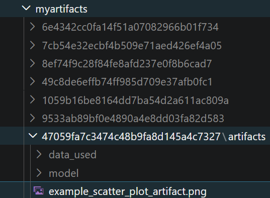
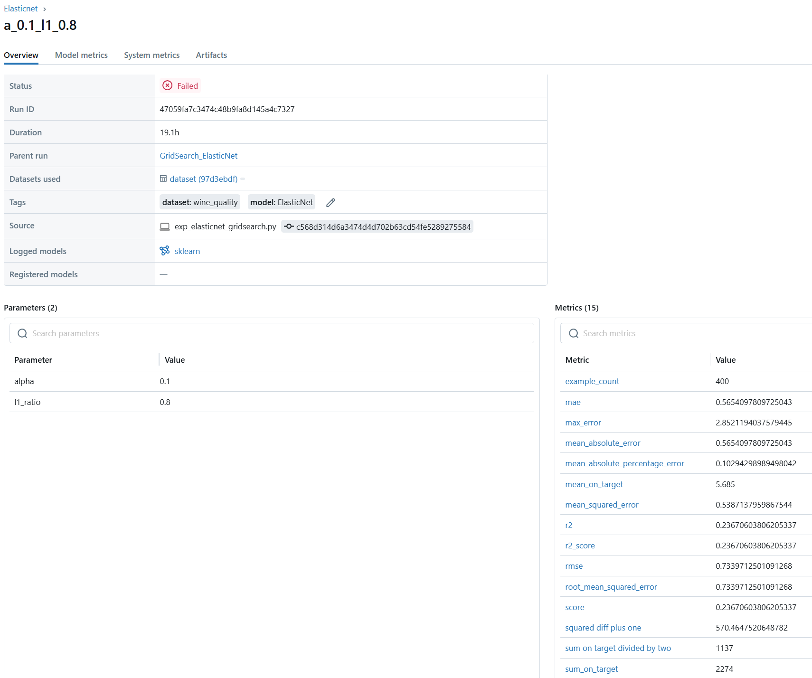

# Sec09: MLflow Model Evaluation

## Tóm tắt
*   **Mục tiêu**: Đánh giá hiệu năng model trước khi deploy bằng cách sử dụng `mlflow.evaluate()`.
*   **Tự động hóa**: Tự động tính toán bộ Metrics chuẩn (RMSE, MAE, Accuracy, F1...) tùy theo **model_type**.
*   **Giải thích (Explainability)**: Tích hợp thư viện **SHAP** để tạo biểu đồ Feature Importance và Model Summary.
*   **Linh hoạt**: Hỗ trợ đánh giá trực tiếp từ URI model hoặc từ tập dữ liệu tĩnh (Static Dataset).
*   **Customization**: Cho phép định nghĩa thêm **extra_metrics** và **custom_artifacts** (biểu đồ riêng).
*   **Lineage**: Tự động log thông tin Dataset (hash, path) vào tag `mlflow.datasets` để truy vết.
*   **Hỗ trợ đa dạng**: Tương thích Regressor, Classifier, LLMs (QA, Summarization, Text), Retriever.
*   **Ví dụ**: So sánh hiệu năng của mô hình ElasticNet trên tập Test sau khi đã train xong.

---

## 1. Luồng hoạt động của mlflow.evaluate()

- **Quy trình đánh giá** được thực hiện tự động thông **qua các bước logic** sau:

    1.  **Khởi tạo môi trường đánh giá**

        Hệ thống kiểm tra `env_manager`:

        - Nếu là `local` (giá trị mặc định), **MLFlow sử dụng** trực tiếp **Môi trường Python hiện tại** (**Current Python Interpreter**) **để load Model**.
        - Nếu là `virtualenv/conda`, một môi trường độc lập được dựng lên để đảm bảo tính cô lập.

        <div align="center"><code>env_manager</code> → <code>Inference Environment</code></div>

    2.  **Thực thi dự báo (Inference Phase)**

        - MLflow đẩy tập `data` qua model để thu về kết quả dự báo. 
        - Dữ liệu lúc này được chuyển đổi thành **`eval_df`** - một DataFrame nội bộ gồm 2 cột **`["target", "prediction"]`**.

            <div align="center"><code>test_x</code> → <code>model.predict()</code> → <code>eval_df</code></div>

    3.  **Tính toán Metrics & Artifacts**

        - MLflow kích hoạt `DefaultEvaluator` để quét `eval_df`.
        - Evaluator `default` tự động dùng `eval_df` để tính toán các chỉ số dựa trên `model_type` rồi đưa vào đối tượng trung gian `_builtin_metrics`. Nếu có SHAP, hệ thống sẽ thực hiện lấy mẫu (sampling) dữ liệu để vẽ biểu đồ giải thích mô hình.
        - Nếu người dùng khai báo `extra_metrics`, MLflow sẽ tự động "bơm" (inject) Dictionary này cùng với `eval_df` vào tham số của hàm custom.
            
            <div align="center">
            <code>eval_df</code> → <code>DefaultEvaluator</code> → <code>_builtin_metrics (Dict)</code> → <code>Custom Functions</code>
            </div>

            <br>

            ```PYTHON
            def sum_on_target_divided_by_two(eval_df, _builtin_metrics):
                """
                Returns half of the built-in 'sum_on_target' metric.
                """
                return _builtin_metrics["sum_on_target"] / 2

            sum_on_target_divided_by_two_metric = mlflow.models.make_metric(
                eval_fn=sum_on_target_divided_by_two,
                greater_is_better=True,
                name="sum on target divided by two"
            )
            ```

    4. **Ghi log và Lưu trữ kết quả** (Logging Phase)

        Sau khi các tính toán hoàn tất, MLflow thực hiện phân loại và đẩy dữ liệu về hệ thống lưu trữ theo hai luồng riêng biệt:

        - Đối với `extra_metrics` (Các chỉ số dạng số):
            -   **Bản chất**: Các giá trị đơn lẻ (Scalar values).
            -   **Vị trí lưu**: Ghi vào Tracking Server (mặc định tại thư mục `mlruns/<run_id>/metrics` nếu lưu theo uri `file://` dưới dạng text thô).
            -   Tự động xuất hiện tại mục **Metrics** trên MLflow UI.

        - Đối với `extra_artifacts` (File, Biểu đồ, JSON):
            - Đây là các thực thể dữ liệu phức tạp được tạo ra bởi hàm `eval_fn` khi trả về một Dictionary.
            - **Vị trí lưu**: Lưu vào Artifact Store của Run (mặc định tại thư mục `mlruns/<run_id>/artifacts`).

- **Mô phỏng quy trình dữ liệu khi đi qua hàm `mlflow.evaluate()`:**

    ```text
    Evaluation Step:
    ├── Input: test_x (Features) + test_y (Labels) -> data
    ├── Model Predict: results = model.predict(test_x)
    ├── Construct eval_df:
    │   ├── target: [test_y values]
    │   └── prediction: [results values]
    └── Execute Custom Fn: func(eval_df) -> float
    ```

- Sau Evaluate, **`run` được add thêm `extra_artifacts` và `extra_metrics`:**

    <div align="center">
        <i>Demo folder <b><code>artifacts/</code></b> sau khi add <b>extra_artifacts</b> </i>
        <br>
        
    </div>

    <br>

    <div align="center">
        <i>Demo <b><code>mlflow ui</code></b> sau khi <b>run</b> được add <b>extra_artifacts</b> và check valid threshold (<b>Status</b>)</i>
        <br>
        
    </div>


---

## 2. Đi sâu vào các thành phần

### 2.1. Tham số đầu vào

| Tham số | Kiểu dữ liệu | Mô tả | Ví dụ |
| :--- | :--- | :--- | :--- |
| **model** | `str` / `callable` | URI của model (`runs:/...`, `models:/...`) hoặc instance model có phương thức `.predict()`. | `"runs:/abc/model"` |
| **data** | `pd.DataFrame` / `mlflow.data.Dataset` | Tập dữ liệu dùng để đánh giá, bao gồm cả features và targets. | `test_df` |
| **model_type** | `str` | Loại bài toán để MLflow chọn bộ tính toán metric mặc định: `"regressor"` hoặc `"classifier"`. | `"classifier"` |
| **targets** | `str` | Tên cột chứa nhãn thực tế (ground truth) trong tham số `data`. | `"target_column"` |
| **baseline_model** | `str` / `callable` | Model dùng làm hệ quy chiếu. MLflow sẽ tính toán sự chênh lệch (diff) giữa model chính và baseline này. | `"runs:/old_run_id/model"` |
| **validation_thresholds** | `dict` | Các ngưỡng kiểm tra chất lượng. Nếu model không đạt hết tất cả các tiêu chí, hàm sẽ raise Exception. Dùng để làm Quality Gate. | `{"accuracy": MetricThreshold(threshold=0.8)}` |
| **predictions** | `str` | (Tùy chọn) Tên cột chứa kết quả dự báo nếu bạn đã có sẵn cột dự báo trong `data`. | `"predicted_label"` |
| **evaluators** | `str` / `list` | Trình đánh giá kết quả. Mặc định là `"default"`. | `["default"]` |
| **extra_metrics** | `list` | Danh sách các hàm custom metrics bổ sung ngoài bộ mặc định của MLflow. | `[custom_f2_score]` |
| **evaluator_config** | `dict` | Cấu hình nâng cao cho trình đánh giá (Ví dụ: `pos_label`, `binarize_threshold`, `log_model_explainability`). | `{"binarize_threshold": 0.5}` |
| **dataset_name** | `str` | Tên của tập dữ liệu để hiển thị rõ ràng trên MLflow UI. | `"validation_set_2024"` |
| **dataset_path** | `str` | Đường dẫn/URL đến dữ liệu gốc (được lưu như một thẻ tag để truy vết). | `"s3://bucket/data.csv"` |

---

### 2.2. Custom Metric
- Trong quy trình đánh giá, đôi khi bộ metrics mặc định không đủ. **MLflow cho phép inject các hàm custom metric riêng**.

    1.  **Cơ chế hoạt động**: Hàm custom nhận vào `eval_df` (chứa cột `prediction` và `target`) và `_builtin_metrics`.
        -   **eval_df**: DataFrame chứa kết quả dự báo thực tế của model trên tập `data`.
        -   **_builtin_metrics**: Dictionary chứa các metrics mặc định để tái sử dụng trong công thức. 
    2.  **Hành động hệ thống**: MLflow map các giá trị dự báo vào DataFrame tạm thời, thực thi hàm và log kết quả trả về vào Tracking Server.

        <div align="center">
            <code>Source_Key (eval_df)</code> → <code>Process (make_metric)</code> → <code>Destination (Metric Value)</code>
        </div>

        <br>

        ```PYTHON
        def sum_on_target_divided_by_two(eval_df, _builtin_metrics):
            """
            Returns half of the built-in 'sum_on_target' metric.
            """
            return _builtin_metrics["sum_on_target"] / 2

        sum_on_target_divided_by_two_metric = mlflow.models.make_metric(
            eval_fn=sum_on_target_divided_by_two,
            greater_is_better=True,
            name="sum on target divided by two"
        )
        ```


### 2.3. Validation Threshold

### 2.3. Validation Threshold
* Tham số truyền vào:
    | Tham số | Ý nghĩa | Khi `True` (Càng cao càng tốt) | Khi `False` (Càng thấp càng tốt) |
    | :--- | :--- | :--- | :--- |
    | **threshold** | Ngưỡng tuyệt đối | $Metric_{new} \geq threshold$ | $Metric_{new} \leq threshold$ |
    | **min_absolute_change** | Mức thay đổi tối thiểu | $Metric_{new} - Metric_{base} \geq \Delta_{abs}$ | $Metric_{base} - Metric_{new} \geq \Delta_{abs}$ |
    | **min_relative_change** | % cải thiện tối thiểu | $\frac{Metric_{new} - Metric_{base}}{Metric_{base}} \geq \Delta_{\%}$ | $\frac{Metric_{base} - Metric_{new}}{Metric_{base}} \geq \Delta_{\%}$ |

* **Workflow kiểm tra model**
    *   **Nếu model không vượt qua các ngưỡng thiết lập:** MLflow sẽ **trả về ngoại lệ** `ModelValidationException`, đồng thời **đánh dấu trạng thái FAILED** trên UI. Điều này ngăn chặn việc triển khai các mô hình kém chất lượng.
    * **Logic cải thiện:** Khi `greater_is_better=False`, "cải thiện" nghĩa là giá trị mới phải **thấp hơn** giá trị cũ (ví dụ: giảm Loss, giảm RMSE).
    * **Khi baseline_model = None:** Các công thức có chứa $Metric_{base}$ bị vô hiệu hóa. Hệ thống chỉ xét cột **threshold**. Nếu thiếu cả `threshold`, bước kiểm tra sẽ được bỏ qua (Success).

* Ví dụ:

    ```python
    thresholds = {
        "mean_squared_error": mlflow.models.MetricThreshold(
            threshold=0.6,             # Absolute max limit
            min_absolute_change=0.1,   # Must improve by at least 0.1 vs baseline
            min_relative_change=0.05,  # Must improve by at least 5% vs baseline
            greater_is_better=False    # For MSE, lower values are better
        )
    }
    ```

## 3. Code mẫu triển khai
```PYTHON
def squared_diff_plus_one(eval_df, _builtin_metrics):
    """
    Calculates the sum of squared differences between predictions 
    and targets, shifted by one.
    """
    return np.sum(np.abs(eval_df["prediction"] - eval_df["target"] + 1) ** 2)

def sum_on_target_divided_by_two(eval_df, _builtin_metrics):
    """
    Returns half of the built-in 'sum_on_target' metric.
    """
    return _builtin_metrics["sum_on_target"] / 2

def prediction_target_scatter(eval_df, _builtin_metrics, artifacts_dir):
    """
    Generates a scatter plot of Predictions vs. Targets and saves it as an artifact.
    """
    plt.figure(figsize=(10, 6))
    plt.scatter(eval_df["prediction"], eval_df["target"], alpha=0.5)
    plt.xlabel("Targets")
    plt.ylabel("Predictions")
    plt.title("Targets vs. Predictions")
    
    # Save plot to the temporary artifacts directory provided by MLflow
    plot_path = os.path.join(artifacts_dir, "example_scatter_plot.png")
    plt.savefig(plot_path)
    plt.close() 
    return {"example_scatter_plot_artifact": plot_path}

# ==================================================================
# MAIN EXECUTION
# ==================================================================

if __name__ == "__main__":
    warnings.filterwarnings("ignore")
    np.random.seed(40)

    # CLI Arguments Setup
    parser = argparse.ArgumentParser(description="Evaluate MLflow models against a baseline.")
    parser.add_argument("--model_run_id", type=str, required=True, help="Run ID of the candidate model")
    parser.add_argument("--baseline_run_id", type=str, required=False, default=None, help="Run ID of the baseline model")
    args = parser.parse_args()

    # MLflow Tracking Configuration
    mlflow.set_tracking_uri("file:///D:/UDEMY/mlops_bc/mlflow_in_action/mlflow_demo/src/local_srv_storage/mlruns")    

    # Construct MLflow URIs (Format: runs:/<run_id>/<model_path>)
    model_uri = f"runs:/{args.model_run_id}/model"
    baseline_uri = f"runs:/{args.baseline_run_id}/model" if args.baseline_run_id else None

    # Load Test Dataset
    try:
        data = pd.read_csv("../experiments/data/test.csv")
    except FileNotFoundError:
        logger.error("Test data file not found at the specified path.")
        exit(1)

    # Wrap custom logic into MLflow Metric objects
    squared_diff_plus_one_metric = mlflow.models.make_metric(
        eval_fn=squared_diff_plus_one,
        greater_is_better=False,
        name="squared diff plus one"
    )

    sum_on_target_divided_by_two_metric = mlflow.models.make_metric(
        eval_fn=sum_on_target_divided_by_two,
        greater_is_better=True,
        name="sum on target divided by two"
    )

    # Define Model Validation Thresholds (Pass/Fail criteria)
    thresholds = {
        "mean_squared_error": mlflow.models.MetricThreshold(
            threshold=0.6,             # Absolute max limit
            min_absolute_change=0.1,   # Must improve by at least 0.1 vs baseline
            min_relative_change=0.05,  # Must improve by at least 5% vs baseline
            greater_is_better=False    # For MSE, lower values are better
        )
    }

    # Execute Evaluation within a dedicated MLflow Run
    with mlflow.start_run(run_id = args.model_run_id) as run:
        evaluate_results = mlflow.evaluate(
            model               = model_uri,
            data                = data,           
            targets             = "quality",
            model_type          = "regressor",
            evaluators          = ["default"],
            extra_metrics       = [
                squared_diff_plus_one_metric,
                sum_on_target_divided_by_two_metric
            ],
            custom_artifacts    = [prediction_target_scatter], 
            validation_thresholds   = thresholds,
            baseline_model          = baseline_uri
        )
        
    print("-" * 40)
    print("Evaluation Completed Successfully!")
    print(f"Candidate Model: {model_uri}")
    print(f"Baseline Model:  {baseline_uri if baseline_uri else 'None'}")
    print(f"Results Logged to Run ID: {run.info.run_id}")
    print("-" * 40)
```