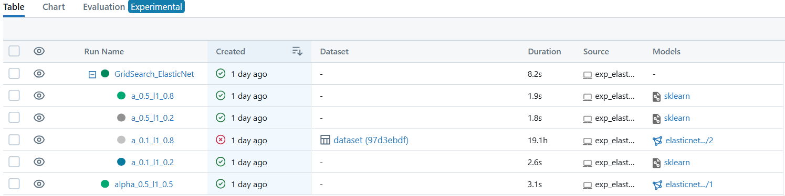
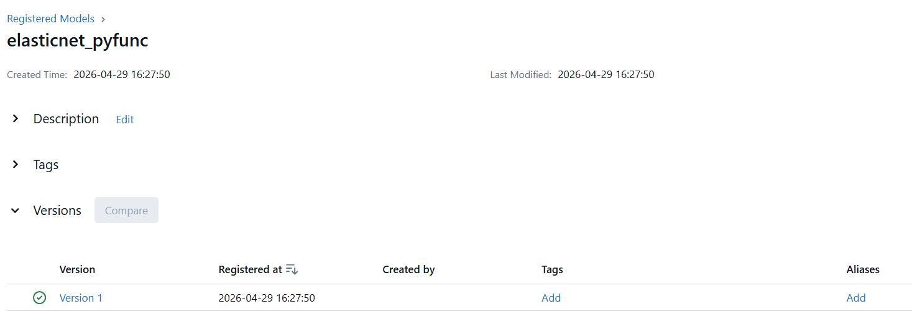

# Sec11: MLflow Model Registry Component

---

## 1. Model Registry Component

### 1.1. Mô tả Model Registry Component
Model Registry là một kho lưu trữ tập trung (Centralized Repository) cho phép quản lý vòng đời của model một cách hệ thống. Nó đóng vai trò như một "App Store" nội bộ, nơi các model được định danh bằng tên và phiên bản thay vì các đường dẫn Artifact rời rạc.

**Tóm tắt cốt lõi:**
* Registry quản lý Model thông qua **Registered Model Name** và **Version**.
* Khi đăng ký trùng tên, MLflow tự động tăng **Version ID** lên $+1$.
* Hỗ trợ gán **Tags** và **Aliases** để đánh dấu mục đích sử dụng.
* Kiểm soát phiên bản (Version Control) chặt chẽ cho các artifact của model.
* Tích hợp cơ chế phê duyệt (Approval Workflow) cho các môi trường doanh nghiệp.
* Hỗ trợ truy xuất model theo Stage để tách biệt môi trường Dev/Prod.
* **Ví dụ:** Đăng ký model "Plate_Reg" lần đầu $\rightarrow$ Version 1. Lần sau $\rightarrow$ Version 2.
* Đảm bảo tính nhất quán giữa nhóm Data Science và đội ngũ DevOps/SRE.

### 1.2. Các Stage của Registered Models
MLflow cung cấp 3 trạng thái mặc định để quản lý luồng triển khai (Deployment Pipeline):

| Stage | Mô tả | Mục đích |
| :--- | :--- | :--- |
| **Staging** | Model này thường là tốt hơn trong các Metric so với Prod, đang trong quá trình kiểm thử (A/B Testing, QA). | Đánh giá hiệu năng trước khi đưa vào Production. |
| **Production** | Model đã sẵn sàng và đang phục vụ yêu cầu thực tế. | Cung cấp Inference API cho người dùng cuối. |
| **Archived** | Model cũ đã được thay thế hoặc không còn sử dụng. | Lưu trữ lịch sử, có thể xóa sau này để dọn dẹp bộ nhớ. |

---

## 2. Các cách Register Model

- Hiện nay có 3 phương thức chính để đăng ký model vào Registry tùy thuộc vào nhu cầu về UI hay Automation.

    | Phương pháp | Tham số chính | Ưu điểm | Ngữ cảnh sử dụng |
    | :--- | :--- | :--- | :--- |
    | **MLflow UI** | Run ID, Model Folder | Trực quan, không cần viết code. | Kiểm tra nhanh hoặc dùng cho người dùng non-coder. |
    | **`log_model()`** | `registered_model_name` | Tối giản, đăng ký ngay khi vừa train xong. | Workflow đơn giản, train và đăng ký trong 1 bước. |
    | **`register_model()`** | `model_uri`, `name` | Linh hoạt, tách rời bước train và register. | CI/CD Pipeline, chọn model tốt nhất từ nhiều Run để đăng ký. |

- Ví dụ: 
    - Register model trên **UI** của **MLFlow**:

        <div align="center">
            <br>
            
        </div>

    - Dùng lệnh **`python register_model.py --run_id b5f198393d36429a8e78143285e74488 --model_name elasticnet_pyfunc`** với file [register_model.py](/mlflow_in_action/mlflow_demo/src/client/model/register_model.py), model đã được register với version 1:

        <div align="center">
            <br>
            
        </div>

### Workflow chi tiết chuyển đổi Stage & Deployment
1. **Khởi tạo và Đăng ký Version:**
    - Khi một Model URI được đăng ký vào tên đã có, hệ thống tạo bản ghi Metadata mới.
    - **Hành động hệ thống:** Map Run ID $\rightarrow$ Model Name $\rightarrow$ Version N.
    - **Mặt vật lý:** Path lưu Artifact từ Run được ánh xạ vào thư mục của Registry.
<div align="center"> `mlflow-artifacts:/123/model` $\rightarrow$ `models:/Plate_Reg/1` </div>

2. **Chuyển đổi sang Production:**
    - Thông thường, mỗi Stage nên giữ **01 Model duy nhất** để tránh xung đột logic của Client.
    - **Xử lý tiến trình cũ (Old Process):** Nếu không gỡ model cũ, các process đã load model đó vào RAM vẫn chạy bản cũ cho đến khi khởi động lại. Các process mới sẽ nhận model mới nhất của Stage đó.
    - **Zero-downtime Deployment (4 cách):**
        - **Blue/Green:** Chạy song song 2 bản, chuyển traffic qua Load Balancer (LB) rồi tắt bản cũ.
        - **Rolling Update:** Cập nhật từng instance trong cụm server (Cluster) để luôn có máy sẵn sàng.
        - **Canary:** Chuyển 5-10% traffic sang model mới để theo dõi lỗi trước khi chuyển 100%.
        - **Feature Flag:** Dùng biến môi trường để app chủ động "switch" URI model mà không cần Restart.

3. **Gỡ bỏ Stage (Archiving):**
    - Khi gỡ Stage model cũ, Client gọi theo tag `Production` sẽ ngay lập tức chuyển hướng sang Version mới nhất được gán tag này.
    - **Thay đổi dữ liệu:** Trạng thái Metadata chuyển từ `current_stage: "Production"` $\rightarrow$ `"Archived"`.

---

## 3. Code mẫu dùng register_model()


```PYTHON
import mlflow
from mlflow.tracking import MlflowClient

def register_and_promote_model(run_id, model_name, stage="Staging"):
    # Sử dụng URI từ Run ID thực tế để đăng ký vào Registry
    model_uri = f"runs:/{run_id}/model"
    
    # Ép kiểu name sang string để đảm bảo MLflow Metadata đọc được
    mv = mlflow.register_model(model_uri=str(model_uri), name=str(model_name))
    
    print(f"Name: {mv.name} | Version: {mv.version}")
```

