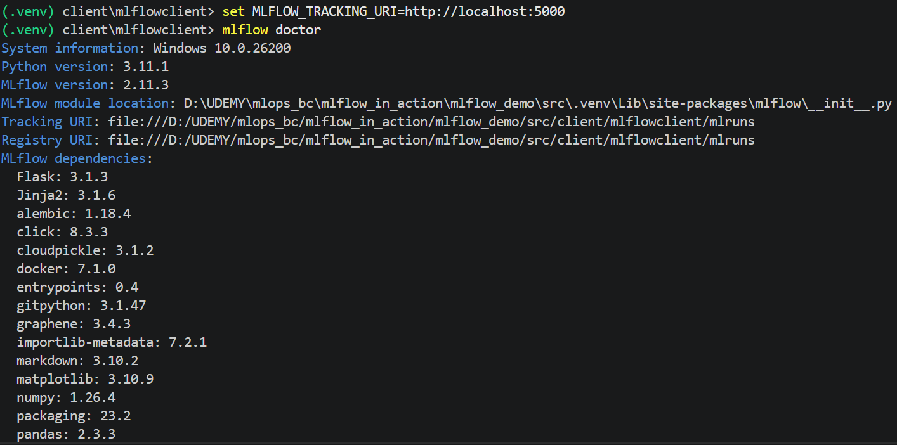

# Section 14: MLflow CLI Commands

- Bên cạnh việc sử dụng Python SDK, MLflow cung cấp một giao diện dòng lệnh (CLI) mạnh mẽ để quản trị hệ thống, kiểm tra lỗi và thao tác nhanh với dữ liệu mà không cần viết code.

- **Trước khi chạy các lệnh CLI**, **cần phải khai báo** cấu hình trỏ đến Tracking Server **`set MLFLOW_TRACKING_URI=http://localhost:5000`** trong terminal:
    | CLI Command (Lệnh terminal) | Công dụng |
    | :--- | :--- |
    | `mlflow doctor` | Kiểm tra và hiển thị thông tin môi trường, cấu hình hệ thống để chẩn đoán lỗi. |
    | `mlflow doctor --mask-envs` | Tương tự như `doctor` nhưng ẩn đi các biến môi trường nhạy cảm (như mật khẩu, token). |
    | `mlflow artifacts list --run-id <id>` | Liệt kê danh sách các tệp tin (mô hình, log, ảnh) của một lần chạy (Run) cụ thể. |
    | `mlflow artifacts download --run-id <id> --dst-path <path>` | Tải các artifact từ server về thư mục cục bộ được chỉ định. |
    | `mlflow artifacts log-artifacts --local-dir <dir> --run-id <id>` | Đẩy ngược các tệp tin từ máy cục bộ lên artifact store của một Run. |
    | `mlflow db upgrade <db_uri>` | Nâng cấp cấu trúc cơ sở dữ liệu (Database Schema) lên phiên bản mới nhất. |
    | `mlflow experiments create --experiment-name <name>` | Tạo một thí nghiệm mới trực tiếp từ terminal. |
    | `mlflow experiments rename --experiment-id <id> --new-name <name>` | Đổi tên một thí nghiệm hiện có thông qua ID. |
    | `mlflow experiments delete --experiment-id <id>` | Xóa tạm thời một thí nghiệm. |
    | `mlflow experiments restore --experiment-id <id>` | Khôi phục lại một thí nghiệm đã bị xóa trước đó. |
    | `mlflow experiments search --view "all"` | Tìm kiếm và liệt kê tất cả các thí nghiệm (bao gồm cả active và deleted). |
    | `mlflow experiments csv --experiment-id <id> --filename <file.csv>` | Xuất toàn bộ dữ liệu của một thí nghiệm ra tệp CSV để phân tích. |
    | `mlflow runs list --experiment-id <id> --view "all"` | Liệt kê danh sách các lần chạy (Runs) thuộc một thí nghiệm nhất định. |
    | `mlflow runs describe --run-id <id>` | Hiển thị thông tin chi tiết về một Run dưới dạng JSON (params, metrics, tags). |
    | `mlflow runs delete --run-id <id>` | Xóa một lần chạy cụ thể. |
    | `mlflow runs restore --run-id <id>` | Khôi phục lại một lần chạy đã bị xóa. |

---

> [!TIP]
> Bạn có thể thêm `--help` sau bất kỳ lệnh nào (ví dụ: `mlflow runs --help`) để xem thêm các tham số bổ sung và hướng dẫn chi tiết từ MLflow.

     
    

